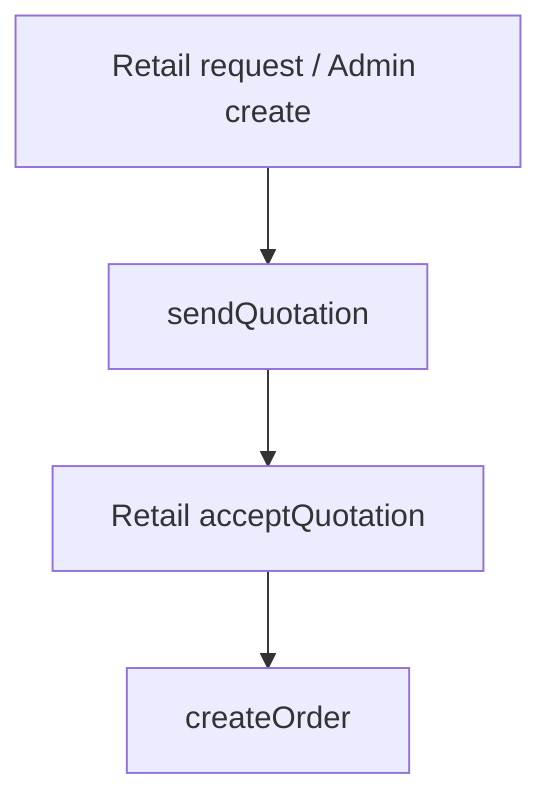

# 03 — Quotations

**Status:** Implemented  
**Actors:** Retail · Super Admin

## Entry routes

| Route | Component |
|---|---|
| `/buyer/quotations` | `QuotationsPage` |
| `/buyer/quotations/:id` | `QuotationDetailPage` |
| `/admin/quotations` | `AdminQuotationsPage` |
| `/admin/quote-templates` | `QuotationTemplatesPage` |

## Store actions

| Action | Effect |
|---|---|
| `createQuotation` | New quote |
| `sendQuotation` | `draft` → `sent` |
| `acceptQuotation` | Creates order; quote → `converted` |
| `rejectQuotation` / `reviseQuotation` / `expireQuotation` | Status changes |
| Template CRUD (`extrasStore`) | Admin reusable line sets |

## Step-by-step

1. Retail requests quote from product **or** Admin creates / applies template.  
2. Admin sends quote.  
3. Retail opens `/buyer/quotations/:id` → **Accept** → order created ([04](./04-orders-fulfillment.md)).

## Flowchart

